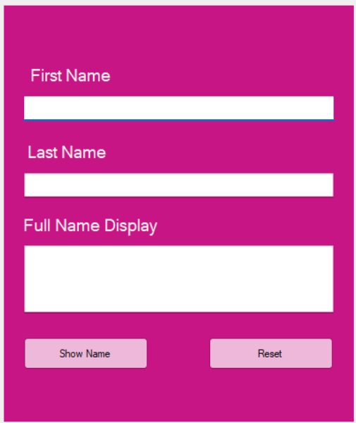
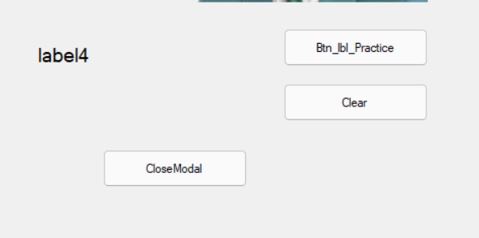
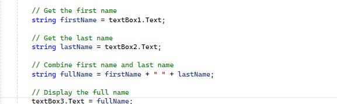
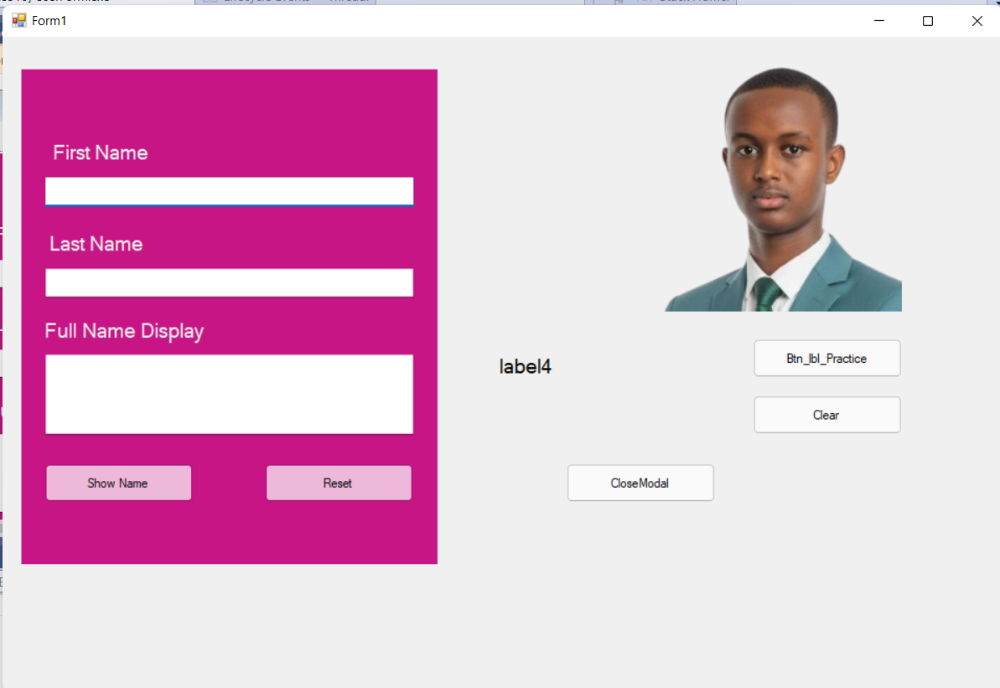
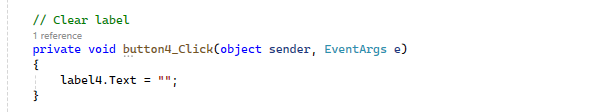

# Week 2 – Processing Data

This week focuses on **processing data using C# Windows Forms**. The practical exercises demonstrate how to work with form controls, retrieve user input, validate form fields, concatenate strings, display results, clear input fields, and close a form.

## Topics Covered

* Windows Forms
* Labels and TextBoxes
* User Input
* Form Validation
* `if` Statements
* `return` Statement
* String Concatenation
* Displaying Results
* Clearing TextBoxes
* Closing the Form
* Button Click Events

---

## 1. Form

This screenshot shows the main Windows Form used for the Week 2 practical exercise.



---

## 2. Labels

This example demonstrates the use of **Labels** in a Windows Forms application to display text and information.



---

## 3. Concatenation

This example demonstrates **string concatenation** in C#.

The first name and last name are combined to create a full name.

```csharp
string firstName = textBox1.Text;
string lastName = textBox2.Text;

string fullName = firstName + " " + lastName;

textBox3.Text = fullName;
```



---

## 4. Form Validation

Form validation is used to make sure that the required fields are not empty before processing the data.

The application uses `if` statements and `string.IsNullOrWhiteSpace()` to validate the First Name and Last Name fields.

```csharp
if (string.IsNullOrWhiteSpace(textBox1.Text))
{
    MessageBox.Show("First Name is required");
    return;
}

if (string.IsNullOrWhiteSpace(textBox2.Text))
{
    MessageBox.Show("Last Name is required");
    return;
}
```

If a required field is empty, an error message is displayed and the program stops processing the current button click.


---

## 5. Result

This screenshot shows the complete result of the application after entering the user's information and processing the form.

The application takes the **First Name** and **Last Name**, combines them, and displays the resulting **Full Name**.



---

## 6. Clear

The **Clear** button removes the entered data from the TextBoxes.

```csharp
private void button2_Click(object sender, EventArgs e)
{
    textBox1.Clear();
    textBox2.Clear();
    textBox3.Clear();
}
```



---

## 7. Close Modal

The **Close** button is used to close the current Windows Form.

```csharp
private void button5_Click(object sender, EventArgs e)
{
    this.Close();
}
```


---

## 8. Technologies Used

* **C#**
* **.NET**
* **Windows Forms**
* **Visual Studio**

---

## Learning Outcome

After completing this practical exercise, I practiced how to:

* Create a Windows Forms application.
* Work with TextBoxes and Labels.
* Receive input from users.
* Validate form input using `if` statements.
* Display validation messages using `MessageBox.Show()`.
* Use `return` to stop execution.
* Concatenate strings in C#.
* Display processed data.
* Clear TextBox values.
* Close a Windows Form using `Close()`.

---

## Author

**Mohamed Amiin**

**C# Programming I – Week 2**
